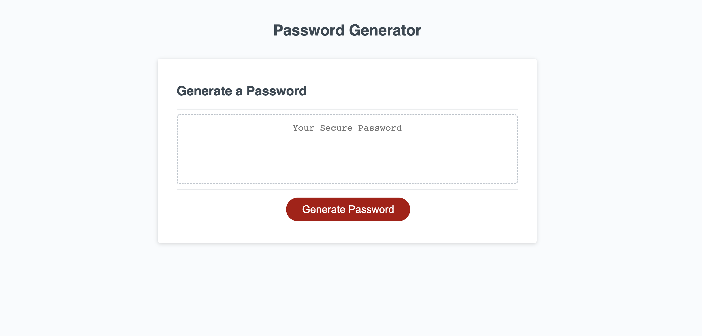

# Password Generator

## Description
A password generator that takes in uppercase, lowercase, numbers and symbols to create a unique and randomized password. User can choose between a combination of the above as long as one is selected. The password is randomized using the Math.random function.

## Mock Up

The following image shows the web application's appearance:

## Link

https://jazgue.github.io/ch03/
